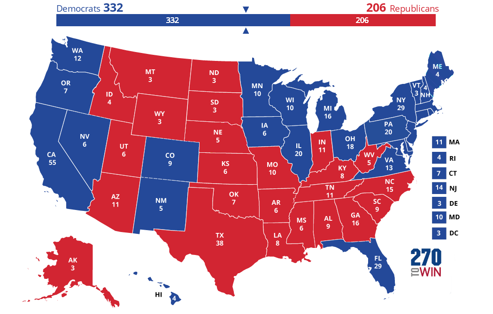

# Applied Data Science @ Columbia
## Fall 2020
## Project 1: Why Did President Barak Obama Win Again If His Approval Ratings Were Declining?



### [Project Description](doc/)
This is the first and only *individual* (as opposed to *team*) this semester. 

Term: Fall 2020

+ Projec title: Why Did President Barak Obama Win Again If His Approval Ratings Were Declining?
+ This project is conducted by Sneha Swati

+ Project summary: This project focuses on the why behind Obama's win the 2012 elections when signs pointed towards him losing the election. His approval ratings during his second run went as low as 40%.


Following [suggestions](http://nicercode.github.io/blog/2013-04-05-projects/) by [RICH FITZJOHN](http://nicercode.github.io/about/#Team) (@richfitz). This folder is orgarnized as follows.

```
proj/
├── dev/
├── data/
├── doc/
├── figs/
└── output/
```

Please see each subfolder for a README file.
